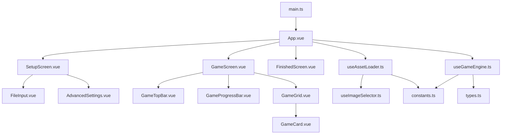

<p align="center">
  
</p>
<p align="center">
  
</p>

<p align="center">
  <a href="README_CN.md">简体中文</a> | <b>English</b> | <a href="README_JA.md">日本語</a>
</p>

<p align="center">
  
  
  
  
  
</p>

<p align="center">
  
  
  
</p>

---

## 📖 About

> This project was born from a spark of inspiration while I was cramming for my Power Electronics final exam. A course like Power Electronics, which relies heavily on memorizing typical circuit structures, is a natural fit for rhythm games like Moo Ma Ka Kai. I wanted to create similar "rapid-fire Q&A" videos for these circuits, but existing solutions seemed to require applying After Effects templates or using mobile editing templates (like those on TikTok/Douyin).
>
> But what if I don't know AE and don't use TikTok? Considering that my requirements were naturally suited for a web-based solution, I built this WebApp using the Vue 3 framework to simplify the video creation process for myself.
>
> If you have similar needs and find this project helpful, I would be truly honored. Please feel free to submit issues or PRs for any bugs or feature requests. I am deeply aware of my limitations and the potential shortcomings of this work; therefore, I am sincerely grateful for any guidance, corrections, or contributions.

A rhythm-based memory game where players memorize and recall images on cards following the music beat. The game uses a **16-beat cycle mechanism**:

- **Reveal Phase (Beat 0-7)**: 8 cards flip open one by one to show images
- **Scan Phase (Beat 8-15)**: Cards flip back, highlighted sequentially for players to recall each card's content

## ✨ Features

### Core Gameplay

- 🎵 **16-Beat Cycle Engine** - Reveal + Scan dual-phase loop
- 🔄 **Multi-Round Games** - Configurable rounds with auto-loop playback
- 🎲 **Dual Game Modes**
  - **Standard Mode**: Display images in file order
  - **Random Mode**: Randomly select 8 unique images per round (Fisher-Yates shuffle algorithm)

### Customization

- ⚡ **BPM Configuration** - Customize music tempo
- ⏱️ **Audio Offset** - Precise music-to-beat synchronization
- 🔢 **Round Settings** - Set custom game rounds

### UI & Experience

- 🌈 **Cyberpunk Neon UI** - Stunning visual effects
- 📊 **Real-time Progress Bar** - Shows current beat position
- 🎯 **Smooth Card Flip Animations** - Optimized transitions without flickering
- 👁️ **UI Toggle** - Press H to hide/show control buttons

### Privacy & Security

- 🔐 **Local Processing Only** - All files processed via Browser File API, never uploaded to any server
- 📡 **Offline Ready** - Works without internet connection after page load
- 🗑️ **Auto Cleanup** - Files automatically cleared from memory when page closes

## 🎹 Keyboard Shortcuts

| Key      | Function                                              |
| -------- | ----------------------------------------------------- |
| `Space`  | Play/Pause                                            |
| `Escape` | Exit Game                                             |
| `H`      | Hide/Show UI (EXIT button, PLAY button, bottom hints) |

## 🚀 Quick Start

### Requirements

- Node.js 18+
- npm or pnpm

### Installation

```bash
# Clone the repository
git clone https://github.com/Quasi2317/mooma-thermo.git
cd mooma-thermo

# Install dependencies
npm install

# Start development server
npm run dev
```

### Build

```bash
# Production build
npm run build

# Preview build
npm run preview
```

## ✅ Code Quality & Checks

### One-Command Check

```bash
npm run check
```

### Fix & Format

```bash
# Auto-fix ESLint warnings (attribute order, unused vars, etc.)
npx eslint . --ext .ts,.vue --fix

# Apply Prettier formatting
npm run format
```

### Recommended Order

```bash
npx eslint . --ext .ts,.vue --fix
npm run format
npm run check
```

## 🎯 How to Play

1. **Select Image Folder** - Click "IMAGE FOLDER" to choose a folder containing images
2. **Select Audio File** - Click "AUDIO FILE" to choose background music (MP3 supported)
3. **Configure Advanced Settings** (Optional)
   - Adjust BPM to match your music
   - Set audio offset for precise sync
   - Choose number of rounds
   - Select game mode (Standard/Random)
4. **Start Game** - Click "PLAY" button

## 🏗️ Project Structure

```
src/
├── assets/
│   └── Mooma-logo.png          # Project logo
├── components/
│   ├── game/
│   │   ├── GameGrid.vue        # Card grid component
│   │   ├── GameProgressBar.vue # Progress bar component
│   │   └── GameTopBar.vue      # Top bar controls
│   ├── setup/
│   │   ├── AdvancedSettings.vue # Advanced settings panel
│   │   └── FileInput.vue       # File selection component
│   ├── FinishedScreen.vue      # Game finished screen
│   ├── GameCard.vue            # Single card component
│   ├── GameScreen.vue          # Game screen
│   ├── SetupScreen.vue         # Setup screen
│   └── index.ts
├── composables/
│   ├── useAssetLoader.ts       # Asset loading logic
│   ├── useGameEngine.ts        # Core game engine
│   ├── useImageSelector.ts     # Image selection (shuffle algorithm)
│   └── index.ts
├── App.vue                     # App entry component
├── constants.ts                # Game constants
├── types.ts                    # TypeScript definitions
├── style.css                   # Global styles (cyberpunk theme)
└── main.ts                     # App entry point
```

## 🔗 File Collaboration Diagram



## 🎨 Tech Stack

- **Vue 3** - Composition API + `<script setup>`
- **TypeScript** - Type safety
- **Vite** - Fast build tool
- **Tailwind CSS 4** - Atomic CSS
- **Modular Architecture** - Composables design pattern

## 📝 Changelog

### v1.0.1

- ✅ Added game finished screen with delayed transition
- ✅ Added finish delay setting (customizable in OPTIONS)
- ✅ Game now stops at max rounds instead of looping

### v1.0.0

- ✅ Implemented 16-beat cycle game engine (reveal + scan phases)
- ✅ Multi-round game support with configurable rounds
- ✅ Cyberpunk neon-style UI
- ✅ Image folder and audio file selection
- ✅ Advanced settings (BPM, audio offset, rounds)
- ✅ Fixed image flickering on round transitions
- ✅ Optimized top bar button layout
- ✅ Added random mode (Fisher-Yates shuffle algorithm)
- ✅ Added H key to toggle UI visibility

## 📄 License

[MIT License](LICENSE) © 2026 Quasi2317
