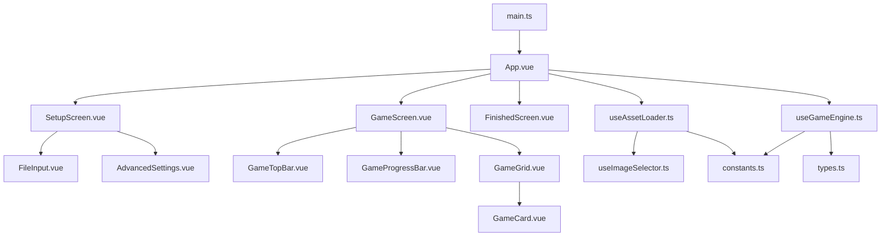

<p align="center">
  
</p>
<p align="center">
  
</p>

<p align="center">
  <b>简体中文</b> | <a href="README.md">English</a> | <a href="README_JA.md">日本語</a>
</p>

<p align="center">
  
  
  
  
  
</p>

<p align="center">
  
  
  
</p>

---

## 📖 关于

> 这个项目起源于我在准备《电力电子技术》期末考试时的灵光一闪。电力电子这种记忆典型电路结构的课程天然适配หมูหมากาไก่这样的节奏记忆游戏。我想做类似的电力电子典型电路快问快答视频，但现在的实现方案貌似是AE制作模板套用或者使用抖音手机版剪软模板来制作。那我既不会ae也不用抖音怎么办呢？考虑到我的需求天然利好web实现，所以我用vue3框架做了这样一个WebApp方便我自己做视频玩。
>
> 如果你也有类似的需求，并且这个项目对你有所帮助，我倍感荣幸。有bug，需求等等都可以发issue或者提pr，鄙人绠短汲深，深感本作中存在诸多不足，因此对任何指导、更正或贡献都心存感激。

这是一个基于节奏的记忆游戏，玩家根据音乐节拍记忆并回忆卡片上的图像。游戏采用 **16 拍循环机制**：

- **展示阶段 (第 0-7 拍)**：8 张卡片依次翻开展示图像
- **扫描阶段 (第 8-15 拍)**：卡片翻回背面，并依次高亮，玩家需回忆每张卡片的内容

## ✨ 特性

### 核心玩法

- 🎵 **16 拍循环引擎** - 展示 + 扫描双阶段循环
- 🔄 **多回合支持** - 可配置回合数及自动循环播放
- 🎲 **两种游戏模式**
  - **标准模式**：按文件顺序显示图像
  - **随机模式**：每回合随机选择 8 张不重复的图像（Fisher-Yates 洗牌算法）

### 自定义设置

- ⚡ **BPM 配置** - 自定义音乐节奏
- ⏱️ **音频偏移** - 精确的音画同步校准
- 🔢 **回合设置** - 设置自定义游戏回合数

### UI 与体验

- 🌈 **赛博朋克霓虹 UI** - 炫酷的视觉效果
- 📊 **实时进度条** - 显示当前节拍位置
- 🎯 **平滑翻牌动画** - 优化后的过渡效果，无闪烁
- 👁️ **UI 切换** - 按 H 键隐藏/显示控制按钮

### 隐私与安全

- 🔐 **仅本地处理** - 所有文件均通过浏览器 File API 处理，绝不上传到任何服务器
- 📡 **离线可用** - 页面加载后无需互联网连接即可运行
- 🗑️ **自动清理** - 页面关闭后，文件会自动从内存中清除

## 🎹 键盘快捷键

| 按键     | 功能                                                  |
| -------- | ----------------------------------------------------- |
| `Space`  | 播放/暂停                                             |
| `Escape` | 退出游戏                                             |
| `H`      | 隐藏/显示 UI (退出按钮、播放按钮、底部提示)           |

## 🚀 快速开始

### 环境要求

- Node.js 18+
- npm 或 pnpm

### 安装

```bash
# 克隆仓库
git clone https://github.com/Quasi2317/mooma-thermo.git
cd mooma-thermo

# 安装依赖
npm install

# 启动开发服务器
npm run dev
```

### 构建

```bash
# 生产环境构建
npm run build

# 预览构建
npm run preview
```

## ✅ 代码质量与检查

### 一键检查

```bash
npm run check
```

### 修复与格式化

```bash
# 自动修复 ESLint 警告（属性顺序、未使用变量等）
npx eslint . --ext .ts,.vue --fix

# 应用 Prettier 格式化
npm run format
```

### 推荐顺序

```bash
npx eslint . --ext .ts,.vue --fix
npm run format
npm run check
```

## 🎯 如何游玩

1. **选择图片文件夹** - 点击 "IMAGE FOLDER" 选择包含图片的文件夹
2. **选择音频文件** - 点击 "AUDIO FILE" 选择背景音乐（支持 MP3）
3. **高级设置**（可选）
   - 调整 BPM 以匹配您的音乐
   - 设置音频偏移以精确同步
   - 选择回合数
   - 选择游戏模式（标准/随机）
4. **开始游戏** - 点击 "PLAY" 按钮

## 🏗️ 项目结构

```
src/
├── assets/
│   └── Mooma-logo.png          # 项目 Logo
├── components/
│   ├── game/
│   │   ├── GameGrid.vue        # 卡片网格组件
│   │   ├── GameProgressBar.vue # 进度条组件
│   │   └── GameTopBar.vue      # 顶部控制栏
│   ├── setup/
│   │   ├── AdvancedSettings.vue # 高级设置面板
│   │   └── FileInput.vue       # 文件选择组件
│   ├── FinishedScreen.vue      # 游戏结束界面
│   ├── GameCard.vue            # 单个卡片组件
│   ├── GameScreen.vue          # 游戏主界面
│   ├── SetupScreen.vue         # 设置界面
│   └── index.ts
├── composables/
│   ├── useAssetLoader.ts       # 资源加载逻辑
│   ├── useGameEngine.ts        # 核心游戏引擎
│   ├── useImageSelector.ts     # 图像选择（洗牌算法）
│   └── index.ts
├── App.vue                     # 应用入口组件
├── constants.ts                # 游戏常量
├── types.ts                    # TypeScript 类型定义
├── style.css                   # 全局样式（赛博朋克主题）
└── main.ts                     # 应用入口点
```

## 🔗 文件协作图



## 🎨 技术栈

- **Vue 3** - Composition API + `<script setup>`
- **TypeScript** - 类型安全
- **Vite** - 快速构建工具
- **Tailwind CSS 4** - 原子化 CSS
- **模块化架构** - Composables 设计模式

## 📝 更新日志

### v1.0.1

- ✅ 添加了带有延迟过渡的游戏结束界面
- ✅ 添加了结束延迟设置（可在 OPTIONS 中自定义）
- ✅ 游戏现在在达到最大回合数时停止，而不是无限循环

### v1.0.0

- ✅ 实现了 16 拍循环游戏引擎（展示 + 扫描阶段）
- ✅ 支持多回合游戏，回合数可配置
- ✅ 赛博朋克霓虹风格 UI
- ✅ 支持图片文件夹和音频文件选择
- ✅ 高级设置（BPM、音频偏移、回合数）
- ✅ 修复了回合转换时的图片闪烁问题
- ✅ 优化了顶部栏按钮布局
- ✅ 添加了随机模式（Fisher-Yates 洗牌算法）
- ✅ 添加了 H 键用于切换 UI 显示状态

## 📄 许可证

[MIT License](LICENSE) © 2026 Quasi2317
