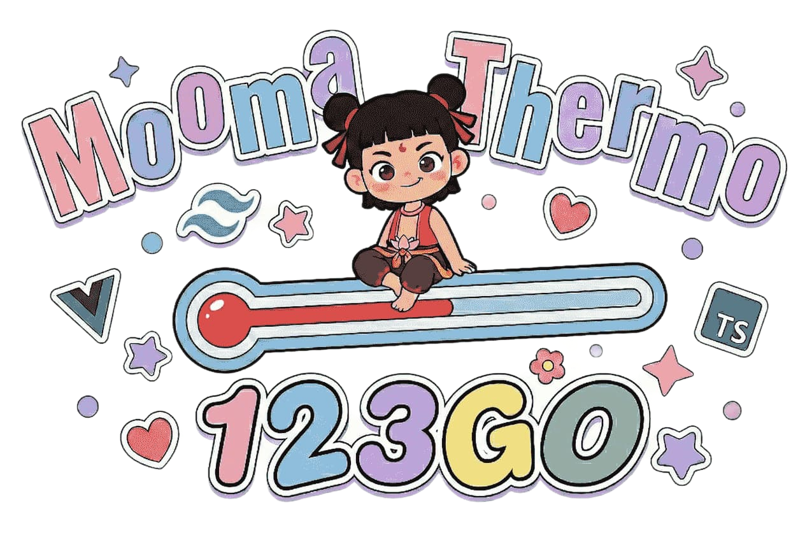
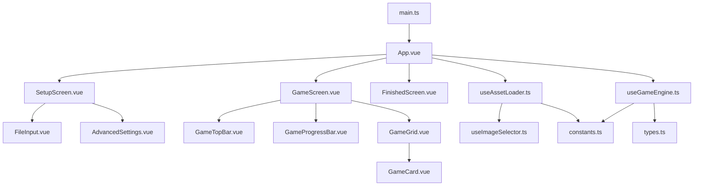

<p align="center">
  
</p>
<p align="center">
  
</p>

<p align="center">
  <a href="README_CN.md">简体中文</a> | <a href="README.md">English</a> | <b>日本語</b>
</p>

<p align="center">
  
  
  
  
  
</p>

<p align="center">
  
  
  
</p>

---

> **Translation Note**
>
> この翻訳はGemini 3 Flashによるものです。翻訳に問題がある場合は、PRを提出してください。


## 📖 はじめに

> このプロジェクトは、『パワーエレクトロニクス』の期末試験勉強中にふと舞い降りたインスピレーションから生まれました。パワーエレクトロニクスのような、典型的な回路構成の暗記が求められる科目は、『ムー・マー・カー・カイ（หมูหมากาไก่）』のようなリズムゲームと非常に相性が良いのです。そこで、私も似たような「パワエレ回路・一問一答」動画を作りたいと思ったのですが、既存の方法ではAfter Effectsのテンプレートを適用するか、TikTok（抖音）などのスマホ編集アプリのテンプレートを使うしかないようでした。
>
> しかし、AEも使えず、TikTokもやっていない私はどうすればいいのか？Web実装こそがこのニーズに最適だと考え、Vue 3フレームワークを用いて、自分で手軽に動画作成を楽しめるこのWebAppを開発しました。
>
> もしあなたにも同様のニーズがあり、このプロジェクトが少しでもお役に立てれば、これ以上の喜びはありません。バグ報告や機能要望などは、遠慮なくIssueやPR（プルリクエスト）を送ってください。浅学非才の身ゆえ、至らぬ点も多々あるかと存じますが、皆様からのご指導、ご訂正、そしてご貢献には心より感謝いたします。

これはリズムベースの記憶ゲームで、プレイヤーは音楽のビートに合わせてカードの画像を覚え、思い出します。ゲームは **16 ビートサイクルメカニズム**を採用しています：

- **表示フェーズ (0-7 ビート)**：8 枚のカードが順番にめくられ、画像が表示されます
- **スキャンフェーズ (8-15 ビート)**：カードが裏に戻り、順番にハイライトされます。プレイヤーは各カードの内容を思い出します

## ✨ 特徴

### コアゲームプレイ

- 🎵 **16 ビートサイクルエンジン** - 表示 + スキャン双方向フェーズループ
- 🔄 **マルチラウンド対応** - ラウンド数設定と自動ループ再生が可能
- 🎲 **2 つのゲームモード**
  - **標準モード**：ファイル順に画像を表示
  - **ランダムモード**：ラウンドごとに 8 枚のユニークな画像をランダムに選択（Fisher-Yates シャッフルアルゴリズム）

### カスタマイズ

- ⚡ **BPM 設定** - 音楽のテンポをカスタマイズ
- ⏱️ **オーディオオフセット** - ビートとの正確な同期
- 🔢 **ラウンド設定** - カスタムゲームラウンドの設定

### UI & エクスペリエンス

- 🌈 **サイバーパンクネオン UI** - 鮮やかな視覚効果
- 📊 **リアルタイムプログレスバー** - 現在のビート位置を表示
- 🎯 **スムーズなカードフリップアニメーション** - チラつきのない最適化された遷移
- 👁️ **UI 切り替え** - H キーで操作ボタンの表示/非表示を切り替え

### プライバシー & セキュリティ

- 🔐 **ローカル処理のみ** - すべてのファイルはブラウザの File API で処理され、サーバーにアップロードされることはありません
- 📡 **オフライン対応** - ページ読み込み後はインターネット接続なしで動作
- 🗑️ **自動クリーンアップ** - ページを閉じるとメモリからファイルが自動的に削除されます

## 🎹 キーボードショートカット

| キー     | 機能                                                  |
| -------- | ----------------------------------------------------- |
| `Space`  | 再生/一時停止                                         |
| `Escape` | ゲーム終了                                           |
| `H`      | UI の表示/非表示 (終了ボタン、再生ボタン、ヒント)     |

## 🚀 クイックスタート

### 必要条件

- Node.js 18+
- npm または pnpm

### インストール

```bash
# リポジトリをクローン
git clone https://github.com/Quasi2317/mooma-thermo.git
cd mooma-thermo

# 依存関係をインストール
npm install

# 開発サーバーを起動
npm run dev
```

### ビルド

```bash
# 本番ビルド
npm run build

# プレビュービルド
npm run preview
```

## ✅ コードの品質とチェック

### 一括チェック

```bash
npm run check
```

### 修正とフォーマット

```bash
# ESLint の警告を自動修正
npx eslint . --ext .ts,.vue --fix

# Prettier フォーマットを適用
npm run format
```

### 推奨手順

```bash
npx eslint . --ext .ts,.vue --fix
npm run format
npm run check
```

## 🎯 遊び方

1. **画像フォルダを選択** - "IMAGE FOLDER" をクリックして画像を含むフォルダを選択
2. **オーディオファイルを選択** - "AUDIO FILE" をクリックして背景音楽（MP3 対応）を選択
3. **詳細設定**（任意）
   - 音楽に合わせて BPM を調整
   - 同期のためにオーディオオフセットを設定
   - ラウンド数を選択
   - ゲームモード（標準/ランダム）を選択
4. **ゲーム開始** - "PLAY" ボタンをクリック

## 🏗️ プロジェクト構造

```
src/
├── assets/
│   └── Mooma-logo.png          # プロジェクトロゴ
├── components/
│   ├── game/
│   │   ├── GameGrid.vue        # カードグリッド
│   │   ├── GameProgressBar.vue # プログレスバー
│   │   └── GameTopBar.vue      # トップバーコントロール
│   ├── setup/
│   │   ├── AdvancedSettings.vue # 詳細設定パネル
│   │   └── FileInput.vue       # ファイル選択コンポーネント
│   ├── FinishedScreen.vue      # ゲーム終了画面
│   ├── GameCard.vue            # シングルカードコンポーネント
│   ├── GameScreen.vue          # ゲーム画面
│   ├── SetupScreen.vue         # セットアップ画面
│   └── index.ts
├── composables/
│   ├── useAssetLoader.ts       # アセット読み込みロジック
│   ├── useGameEngine.ts        # コアゲームエンジン
│   ├── useImageSelector.ts     # 画像選択（シャッフルアルゴリズム）
│   └── index.ts
├── App.vue                     # アプリエントリコンポーネント
├── constants.ts                # ゲーム定数
├── types.ts                    # TypeScript 定義
├── style.css                   # グローバルスタイル
└── main.ts                     # アプリエントリポイント
```

## 🔗 ファイル連携図



## 🎨 技術スタック

- **Vue 3** - Composition API + `<script setup>`
- **TypeScript** - 型安全性
- **Vite** - 高速ビルドツール
- **Tailwind CSS 4** - Atomic CSS
- **モジュール化アーキテクチャ** - Composables デザインパターン

## 📝 変更履歴

### v1.0.1

- ✅ 遅延遷移付きのゲーム終了画面を追加
- ✅ 終了遅延設定を追加 (OPTIONS でカスタマイズ可能)
- ✅ ラウンド上限でゲームが停止するように変更

### v1.0.0

- ✅ 16 ビートサイクルゲームエンジンの実装
- ✅ マルチラウンド対応
- ✅ サイバーパンクネオンスタイル UI
- ✅ 画像フォルダとオーディオファイル選択
- ✅ 詳細設定 (BPM、オーディオオフセット、ラウンド数)
- ✅ ラウンド切り替え時の画像チラつきを修正
- ✅ トップバーのボタンレイアウトを最適化
- ✅ ランダムモードの追加
- ✅ H キーで UI 表示切り替え機能を追加

## 📄 ライセンス

[MIT License](LICENSE) © 2026 Quasi2317
